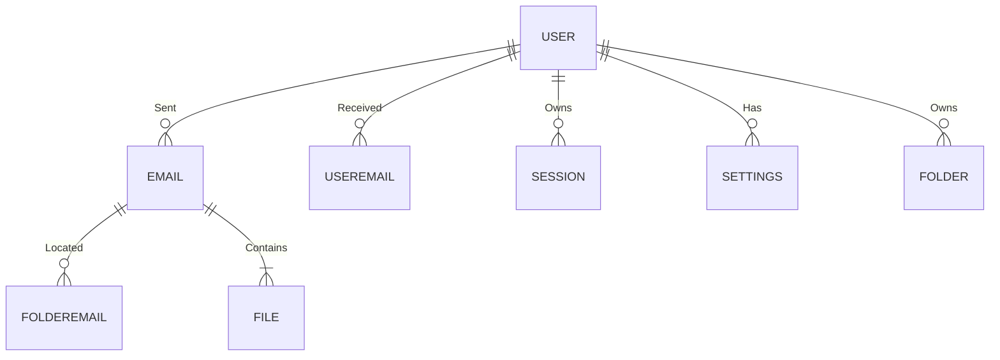
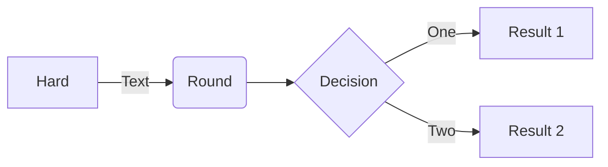

### Relations

#### User
- **Id**: Уникальный идентификатор пользователя в базе данных.
- **Login**: Электронная почта пользователя, используемая для входа.
- **Password**: Пароль пользователя.
- **Name**: Имя пользователя.
- **Surname**: Фамилия пользователя.
- **Middlename**: Отчество пользователя.
- **Gender**: Пол пользователя.
- **Birthday**: Дата рождения пользователя.
- **RegistrationDate**: Дата регистрации пользователя.
- **AvatarId**: Ссылка на фотографию пользователя.
- **PhoneNumber**: Номер телефона пользователя.
- **Description**: Дополнительная информация, которую пользователь может предоставить о себе.

#### Email
- **Id**: Уникальный идентификатор письма в базе данных.
- **Topic**: Тема письма.
- **Text**: Текст письма.
- **DateOfDispatch**: Дата отправки письма.
- **PhotoId**: Ссылка на фотографию отправителя письма.
- **SenderId**: Уникальный идентификатор пользователя, отправившего письмо.
- **RecipientId**: Уникальный идентификатор пользователя, получившего письмо.
- **ReadStatus**: Статус прочтения письма (прочтено/непрочтено).
- **DeletedStatus**: Статус удаления письма (в корзине/не в корзине).
- **DraftStatus**: Статус черновика письма (черновик/не черновик).
- **ReplyToEmailId**: Уникальный идентификатор письма, на который данное письмо является ответом (если есть).
- **Flag**: Флаг, который может быть установлен пользователем (например, помечено как важное).

#### File
- **Id**: Уникальный идентификатор вложения в базе данных.
- **EmailId**: Уникальный идентификатор письма, к которому прикреплено вложение.
- **DocumentId**: Ссылка на документ.
- **VideoId**: Ссылка на видео.
- **GifId**: Ссылка на гифку.
- **MusicId**: Ссылка на музыку.
- **ArchiveId**: Ссылка на архив.

#### UserEmail
- **Id**: Уникальный идентификатор связи пользователя с письмом в базе данных.
- **UserId**: Уникальный идентификатор пользователя, участвующего в переписке.
- **EmailId**: Уникальный идентификатор письма, полученного или отправленного пользователем.

#### Folder
- **Id**: Уникальный идентификатор папки в базе данных.
- **UserId**: Уникальный идентификатор пользователя, которому принадлежит папка.
- **Name**: Название папки.

#### FolderEmail
- **Id**: Уникальный идентификатор связи папки с письмом в базе данных.
- **FolderId**: Уникальный идентификатор папки, в которой находится письмо.
- **EmailId**: Уникальный идентификатор письма, находящегося в папке.

#### Settings
- **Id**: Уникальный идентификатор настроек пользователя в базе данных.
- **UserId**: Уникальный идентификатор пользователя, которому принадлежат настройки.
- **NotificationTolerance**: Статус уведомлений пользователя (включены/выключены).
- **Language**: Язык интерфейса пользователя.

#### Session
- **Id**: Уникальный идентификатор сессии пользователя в базе данных.
- **UserId**: Уникальный идентификатор пользователя, которому принадлежит сессия.
- **CreationDate**: Дата и время создания сессии.
- **Device**: Устройство, с которого была инициирована сессия.
- **LifeTime**: Время действия сессии.
- **CsrfToken**: Токен CSRF, используемый для защиты от атак межсайтовой подделки запросов.



```
flowchart LR

A[Hard] -->|Text| B(Round)
B --> C{Decision}
C -->|One| D[Result 1]
C -->|Two| E[Result 2]
```



erDiagram
    USER ||--o{ EMAIL : "Sent"
    USER ||--o{ USEREMAIL : "Received"
    USER {
        Id
        Login
        Password
        Name
        Surname
        Middlename
        Gender
        Birthday
        RegistrationDate
        AvatarId
        PhoneNumber
        Description
    }
    EMAIL ||--o{ FILE : "Contains"
    EMAIL {
        Id
        Topic
        Text
        DateOfDispatch
        PhotoId
        SenderId
        RecipientId
        ReadStatus
        DeletedStatus
        DraftStatus
        ReplyToEmailId
        Flag
    }
    FILE {
        Id
        EmailId
        DocumentId
        VideoId
        GifId
        MusicId
        ArchiveId
    }
    USEREMAIL {
        Id
        UserId
        EmailId
    }
    FOLDER {
        Id
        UserId
        Name
    }
    FOLDEREMAIL {
        Id
        FolderId
        EmailId
    }
    SETTINGS {
        Id
        UserId
        NotificationTolerance
        Language
    }
    SESSION {
        Id
        UserId
        CreationDate
        Device
        LifeTime
        CsrfToken
    }