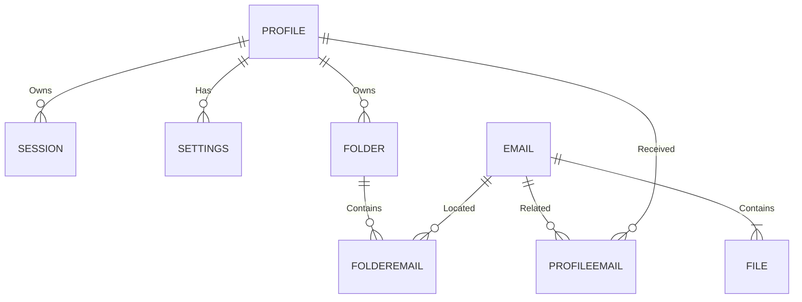
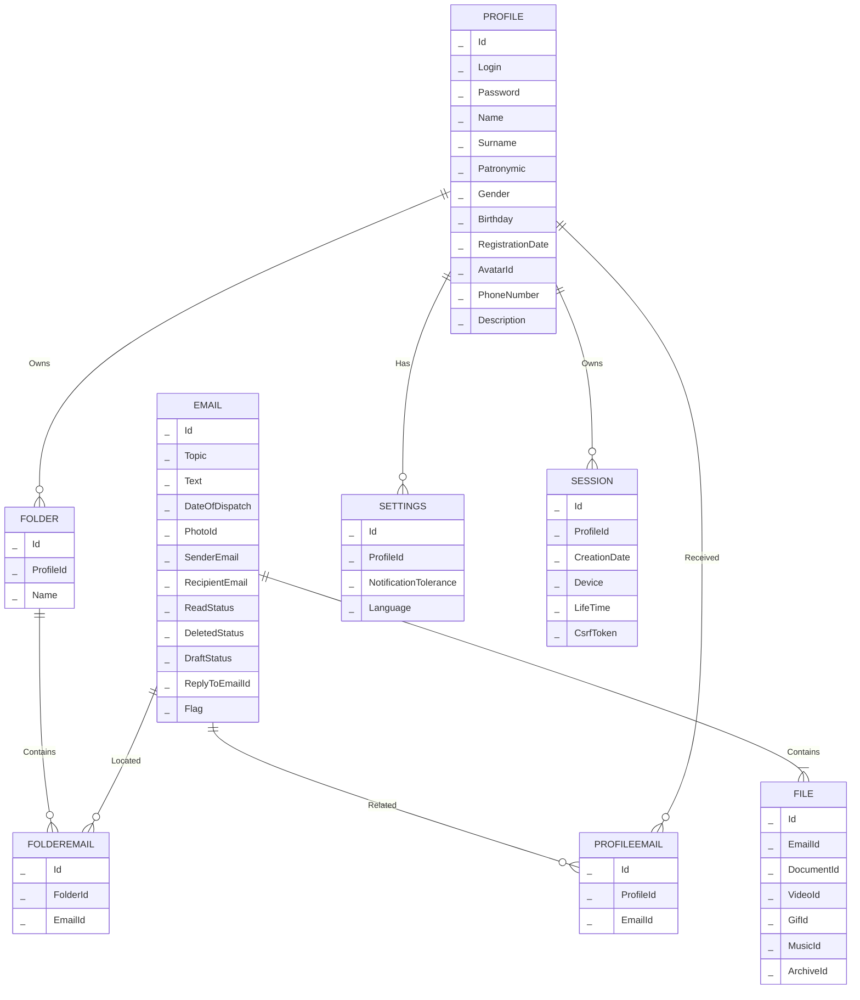

### Relations

#### Profile
- **Id**: Уникальный идентификатор пользователя в базе данных.
- **Login**: Электронная почта пользователя, используемая для входа.
- **Password**: Пароль пользователя.
- **Name**: Имя пользователя.
- **Surname**: Фамилия пользователя.
- **Patronymic**: Отчество пользователя.
- **Gender**: Пол пользователя.
- **Birthday**: Дата рождения пользователя.
- **RegistrationDate**: Дата регистрации пользователя.
- **AvatarId**: Ссылка на фотографию пользователя.
- **PhoneNumber**: Номер телефона пользователя.
- **Description**: Дополнительная информация, которую пользователь может предоставить о себе.

#### Email
- **Id**: Уникальный идентификатор письма в базе данных.
- **Topic**: Тема письма.
- **Text**: Текст письма.
- **DateOfDispatch**: Дата отправки письма.
- **PhotoId**: Ссылка на фотографию отправителя письма.
- **SenderEmail**: Электронная почта пользователя, отправившего письмо.
- **RecipientEmail**: Электронная почта пользователя, получившего письмо.
- **ReadStatus**: Статус прочтения письма (прочтено/непрочтено).
- **DeletedStatus**: Статус удаления письма (в корзине/не в корзине).
- **DraftStatus**: Статус черновика письма (черновик/не черновик).
- **ReplyToEmailId**: Уникальный идентификатор письма, на который данное письмо является ответом (если есть).
- **Flag**: Флаг, который может быть установлен пользователем (например, помечено как важное).

#### File
- **Id**: Уникальный идентификатор вложения в базе данных.
- **EmailId**: Уникальный идентификатор письма, к которому прикреплено вложение.
- **DocumentId**: Ссылка на документ.
- **VideoId**: Ссылка на видео.
- **GifId**: Ссылка на гифку.
- **MusicId**: Ссылка на музыку.
- **ArchiveId**: Ссылка на архив.

#### ProfileEmail
- **Id**: Уникальный идентификатор связи пользователя с письмом в базе данных.
- **ProfileId**: Уникальный идентификатор пользователя, участвующего в переписке.
- **EmailId**: Уникальный идентификатор письма, полученного или отправленного пользователем.

#### Folder
- **Id**: Уникальный идентификатор папки в базе данных.
- **ProfileId**: Уникальный идентификатор пользователя, которому принадлежит папка.
- **Name**: Название папки.

#### FolderEmail
- **Id**: Уникальный идентификатор связи папки с письмом в базе данных.
- **FolderId**: Уникальный идентификатор папки, в которой находится письмо.
- **EmailId**: Уникальный идентификатор письма, находящегося в папке.

#### Settings
- **Id**: Уникальный идентификатор настроек пользователя в базе данных.
- **ProfileId**: Уникальный идентификатор пользователя, которому принадлежат настройки.
- **NotificationTolerance**: Статус уведомлений пользователя (включены/выключены).
- **Language**: Язык интерфейса пользователя.

#### Session
- **Id**: Уникальный идентификатор сессии пользователя в базе данных.
- **ProfileId**: Уникальный идентификатор пользователя, которому принадлежит сессия.
- **CreationDate**: Дата и время создания сессии.
- **Device**: Устройство, с которого была инициирована сессия.
- **LifeTime**: Время действия сессии.
- **CsrfToken**: Токен CSRF, используемый для защиты от атак межсайтовой подделки запросов.

---
Simple ER-diagram
---

---
ER-diagram
---

### Functional Dependencies

#### Profile:
- {Id} -> Login, Password, Name, Surname, Middlename, Gender, Birthday, RegistrationDate, AvatarId, PhoneNumber, Description

#### Email:
- {Id} -> Topic, Text, DateOfDispatch, PhotoId, SenderEmail, RecipientEmail, ReadStatus, DeletedStatus, DraftStatus, ReplyToEmailId, Flag

#### File:
- {Id} -> EmailId, DocumentId, VideoId, GifId, MusicId, ArchiveId

#### ProfileEmail:
- {Id} -> ProfileId, EmailId

#### Folder:
- {Id} -> Name, UserId

#### FolderEmail:
- {Id} -> FolderId, EmailId

#### Settings:
- {Id} -> ProfileId, NotificationTolerance, Language

#### Session:
- {Id} -> ProfileId, CreationDate, Device, LifeTime, CsrfToken

### Functional Dependencies Explanation:

- 1NF: Все отношения имеют простые атрибуты и уникальные идентификаторы (ключи).

- 2NF: Нет частичных функциональных зависимостей, каждый атрибут полностью функционально зависит от первичного ключа.

- 3NF: Нет транзитивных функциональных зависимостей, каждый неключевой атрибут функционально зависит только от первичного ключа.

- BCNF: Все отношения не имеют неключевых атрибутов, функционально зависящих от других неключевых атрибутов.
