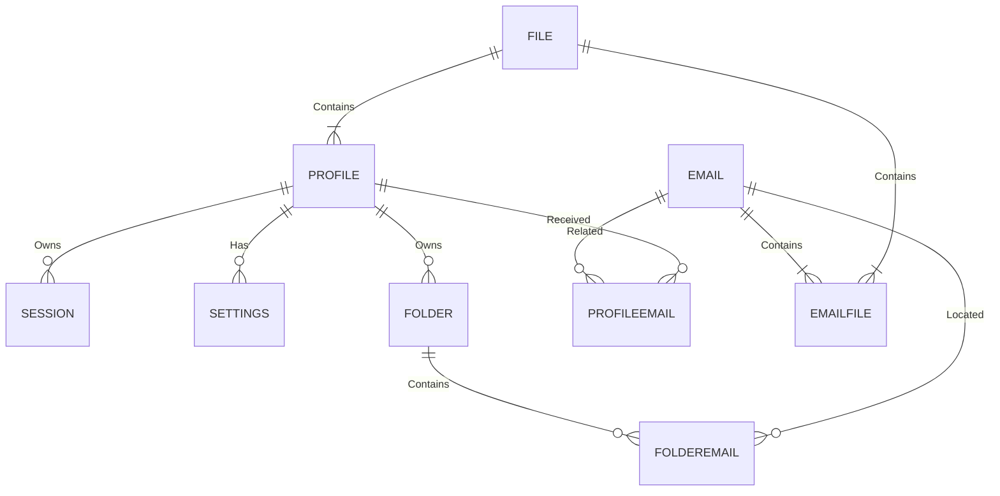
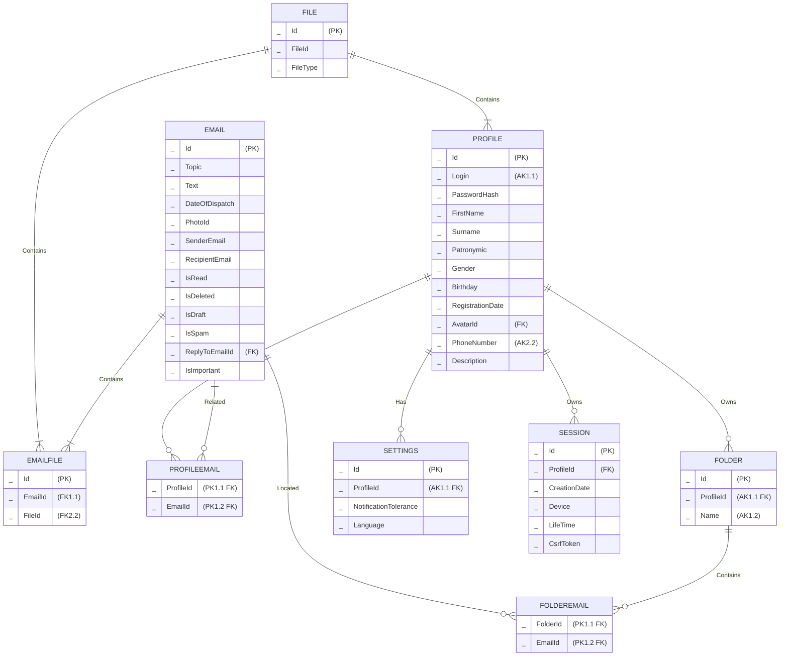

### Relations

#### Profile
- **Id**: Уникальный идентификатор пользователя в базе данных.
- **Login**: Электронная почта пользователя, используемая для входа.
- **PasswordHash**: Хэш пароль пользователя.
- **FirstName**: Имя пользователя.
- **Surname**: Фамилия пользователя.
- **Patronymic**: Отчество пользователя.
- **Gender**: Пол пользователя.
- **Birthday**: Дата рождения пользователя.
- **RegistrationDate**: Дата регистрации пользователя.
- **AvatarId**: Ссылка на фотографию пользователя в таблице файлов.
- **PhoneNumber**: Номер телефона пользователя.
- **Description**: Дополнительная информация, которую пользователь может предоставить о себе.

#### Email
- **Id**: Уникальный идентификатор письма в базе данных.
- **Topic**: Тема письма.
- **Text**: Текст письма.
- **DateOfDispatch**: Дата отправки письма.
- **PhotoId**: Ссылка на фотографию отправителя письма.
- **SenderEmail**: Электронная почта пользователя, отправившего письмо.
- **RecipientEmail**: Электронная почта пользователя, получившего письмо.
- **IsRead**: Статус прочтения письма (прочтено/непрочтено).
- **IsDeleted**: Статус удаления письма (в корзине/не в корзине).
- **IsDraft**: Статус черновика письма (черновик/не черновик).
- **IsSpam**: Статус спама письма (спам/не спам).
- **ReplyToEmailId**: Уникальный идентификатор письма, на который данное письмо является ответом (если есть).
- **IsImportant**: Флаг, который может быть установлен пользователем (например, помечено как важное).

#### File
- **Id**: Уникальный идентификатор вложения в базе данных.
- **FileId**: Ссылка на файл.
- **FileType**: Тип файла.

#### EmailFile
- **Id**: Уникальный идентификатор вложения в базе данных.
- **EmailId**: Ссылка на письмо в таблице email
- **FileId**: Ссылка на файл в таблице файлов.

#### Folder
- **Id**: Уникальный идентификатор папки в базе данных.
- **ProfileId**: Уникальный идентификатор пользователя, которому принадлежит папка.
- **Name**: Название папки.

#### FolderEmail
- **FolderId**: Уникальный идентификатор папки, в которой находится письмо.
- **EmailId**: Уникальный идентификатор письма, находящегося в папке.

#### Settings
- **Id**: Уникальный идентификатор настроек пользователя в базе данных.
- **ProfileId**: Уникальный идентификатор пользователя, которому принадлежат настройки.
- **NotificationTolerance**: Статус уведомлений пользователя (включены/выключены).
- **Language**: Язык интерфейса пользователя.

#### Session
- **Id**: Уникальный идентификатор сессии пользователя в базе данных.
- **ProfileId**: Уникальный идентификатор пользователя, которому принадлежит сессия.
- **CreationDate**: Дата и время создания сессии.
- **Device**: Устройство, с которого была инициирована сессия.
- **LifeTime**: Время действия сессии.
- **CsrfToken**: Токен CSRF, используемый для защиты от атак межсайтовой подделки запросов.

---
Simple ER-diagram
---

---
ER-diagram
---

### Functional Dependencies

#### Profile:
- {Id} -> Login, PasswordHash, FirstName, Surname, Middlename, Gender, Birthday, RegistrationDate, AvatarId, PhoneNumber, Description
- {Login} -> id, PasswordHash, FirstName, Surname, Middlename, Gender, Birthday, RegistrationDate, AvatarId, PhoneNumber, Description
- {PhoneNumber} -> id, Login, PasswordHash, FirstName, Surname, Middlename, Gender, Birthday, RegistrationDate, AvatarId, Description

#### Email:
- {Id} -> Topic, Text, DateOfDispatch, PhotoId, SenderEmail, RecipientEmail, IsRead, IsDeleted, IsDraft, IsSpam, ReplyToEmailId, IsImportant

#### File:
- {Id} -> EmailId, FileId, FileType

#### EmailFile:
- {Id} -> EmailId, FileId

#### ProfileEmail:
- {ProfileId, EmailId}

#### Folder:
- {Id} -> Name, UserId
- {Name, UserId} -> Id

#### FolderEmail:
- {FolderId, EmailId}

#### Settings:
- {Id} -> ProfileId, NotificationTolerance, Language
- {ProfileId} -> Id, NotificationTolerance, Language

#### Session:
- {Id} -> ProfileId, CreationDate, Device, LifeTime, CsrfToken

### Candidate Key

#### Profile:
- {Id}
- {Login}
- {PhoneNumber}

#### Email:
- {Id}

#### File:
- {Id}

#### EmailFile:
- {Id}

#### ProfileEmail:
- {ProfileId, EmailId}

#### Folder:
- {Id}
- {Name, UserId}

#### FolderEmail:
- {FolderId, EmailId}

#### Settings:
- {Id}
- {ProfileId}

#### Session:
- {Id}

### Primary Key

#### Profile:
- {Id}

#### Email:
- {Id}

#### File:
- {Id}

#### EmailFile:
- {Id}

#### ProfileEmail:
- {ProfileId, EmailId}

#### Folder:
- {Id}

#### FolderEmail:
- {FolderId, EmailId}

#### Settings:
- {Id}

#### Session:
- {Id}

### Functional Dependencies Explanation:

- 1NF: Все отношения имеют простые атрибуты и уникальные идентификаторы (ключи).

- 2NF: Нет частичных функциональных зависимостей, каждый атрибут полностью функционально зависит от первичного ключа.

- 3NF: Нет транзитивных функциональных зависимостей, каждый неключевой атрибут функционально зависит только от первичного ключа.

- BCNF: Все отношения не имеют неключевых атрибутов, функционально зависящих от других неключевых атрибутов.